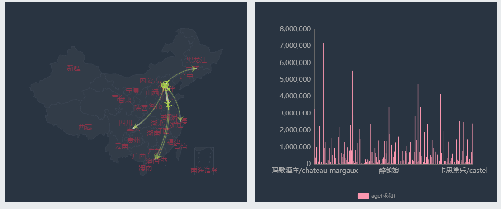
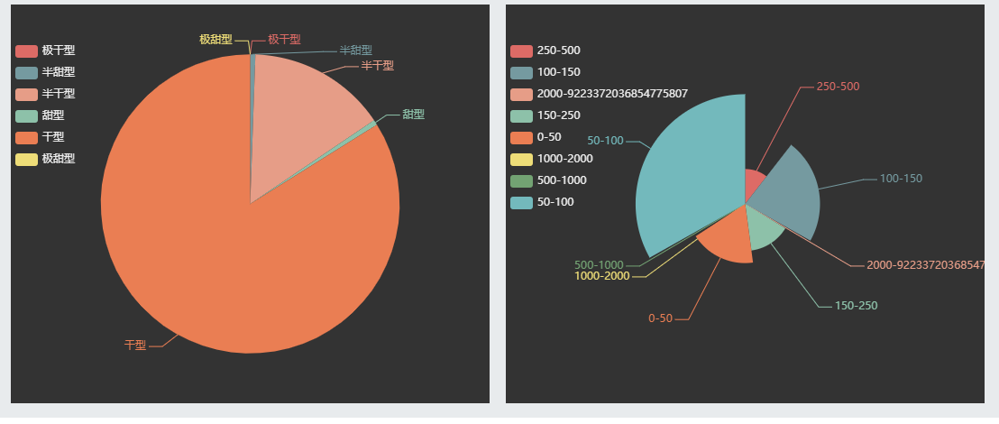
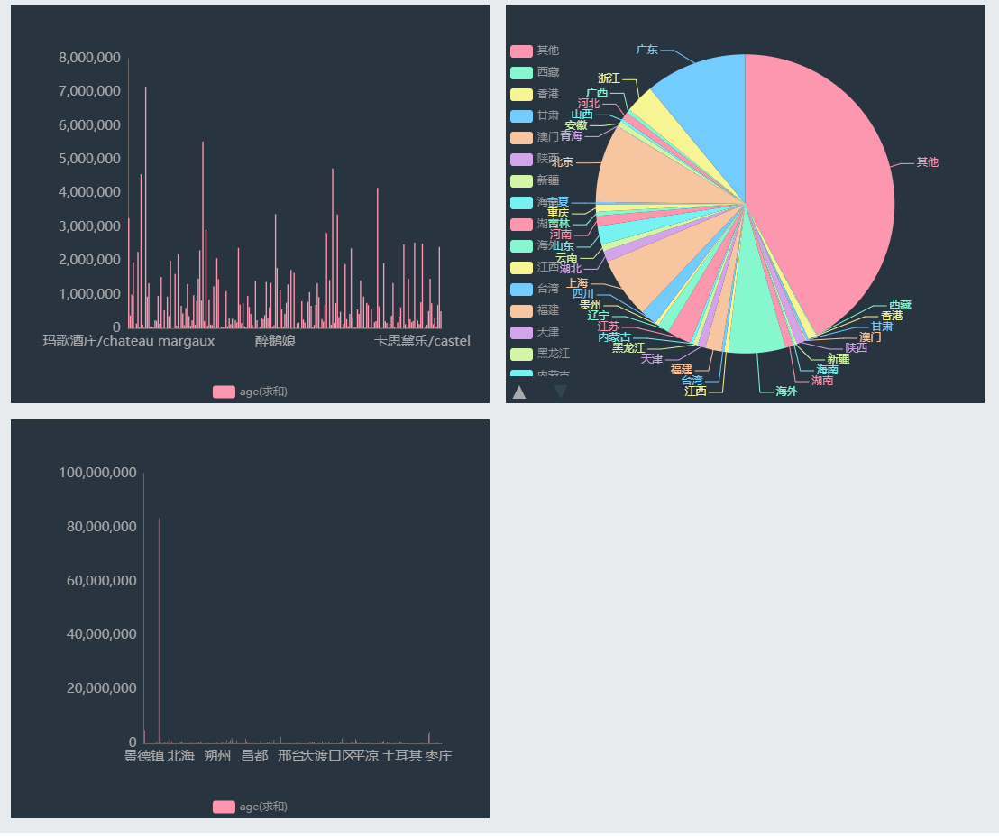

<table border="0">
  <tr>
    <td>
      <h1>王任义</h1>
      
<b>石家庄铁道大学本科学士学位</b>

      
<b>石家庄铁道大学信息科学与技术学院</b>

      
<b>邮箱：1544476096@qq.com</b>

      
<b>地址：河北省石家庄市石家庄铁道大学</b>

    </td>
  </tr>
  <tr>
  <td width = "70%">
      
  </td>
  </tr>
</table>

---
王任义，本科石家庄铁道大学软件工程专业学生，目前就读于石家庄铁道大学，兴趣包括：
  * 信息抽取和知识图谱
  * 自然语言处理
  * 机器学习

---
## 一、开源项目
<table border="0">
  <tr>
  <td><h5>项目名称</h5></td><td><h5>中文名称</h5></td><td><h5>项目技术点</h5></td>
  </tr>
  <tr>
  <td><a href = "https://github.com/wangrenyisme/Shukongdashi">Shukongdashi</a></td><td>数控大师-基于移动端在线设备故障诊断平台</td><td>知识库的构建和维护、数控机床故障诊断的只能问答系统</td>
  </tr>
</table>

---
## 二、荣誉奖励
* 2018.12 负责的“大学生表白墙网站”获得石家庄铁道大学网页设计大赛三等奖。 
* 2019.05 参与的“大学生竞赛管理平台”获得 2019 年中国大学生计算机设计大赛河北省赛二等奖。 
* 2019.07 负责的“基于移动端的自适应故障诊断平台”获得第八届“中国软件杯”大学生软件设计大赛华东赛区决赛二等奖、全国总决赛二等奖、优秀创业队伍潜力奖。

---
## 三、项目经历

#### 1. 数控大师APP-基于移动端的自适应故障诊断平台 /大三

**项目简介：**通过学习数控机床历史维修案例，构建知识图谱，实现故障推理诊断。

**技术方案：**Django + Python + APICloud + Neo4j + MySQL

**系统特点：**

1.   对自然语言预处理之后，使用CNN卷积神经网络模型进行内容的理解，结合语义模型，最终形成推理规则。

2.   采用Neo4j图形数据库存储复杂的推理规则。

3.   知识库的自学习，系统爬取网上的解决方案，经过分析处理，不断完善知识库。

4.   诊断结果智能化排序，推理过程可视化。

**详细介绍：**[数控大师](https://github.com/wangrenyisme/Shukongdashi"数控大师-基于移动端的自适应故障诊断平台")

#### 2.大学生竞赛智能管理平台 /大二

**技术方案：**Tomcat + JSP + Layui + Servlet + MySQL

**主要功能： **

1.   教务处发布上级指示文件，承办方发布校内比赛通知；

2.   学生报名参赛，提交比赛作品；

3.   承办方下载比赛作品，对作品打分；

4.   比赛结果汇总统计并导出为Excel； 

#### 3.大学生表白墙网站 /大二

**技术方案：**Tomcat + JSP + Servlet + MySQL

**系统特点：**

1.   对被表白的对象进行智能分析；

2.   如果表白注册过的用户，系统会发送被表白通知给他；

3.   如果表白公众人物，则公众人物参与表白热度排行榜；

4.   用户可以查看表白信息并且评论评论；

#### 4.科技政策影响力分析（毕业设计） /大四

**技术方案：**Tomcat + Spring Boot + Shiro + Mybatis-Plus + Hadoop

**主要功能：**

1.   科技政策提取入库，按照标准规范，经过清洗后，装载至大数据仓库的标准政策数据库中。

2. 科技政策数据关联，通过不同维度的政策分类，实现科技政策与各类科技本体的相互关联。
3. 科技政策应用服务，根据政策的推出、变更，联合智能分析、分类可视化展现，探究科技政策变化对科技创新发展带来的影响，为政策制订提供决策参考。

## 四、作品展示

#### 1. 大学生表白墙网站：

#### 2. 大学生竞赛管理平台：

#### 3. 数控大师App：

1. 故障诊断和解决方法详细信息页面，关系图谱用于展示此结果的推理过程

2. 在线分析爬取网上的解决方法，查看详细信息，反馈功能

3. 智能问答功能

#### 4. 大数据实战项目

##### 	A. 互联网精准营销

    

##### 	B. 跨境电商红酒定价决策

	

	

	
