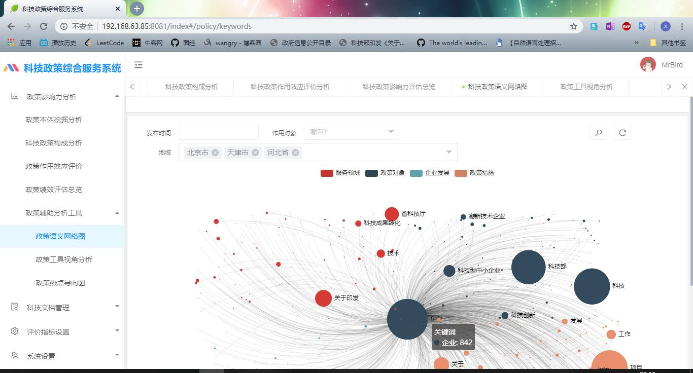

<table border="0">
  <tr>
    <td>
      <h1>王任义</h1>
      
<b>石家庄铁道大学本科学士学位</b>

      
<b>石家庄铁道大学信息科学与技术学院</b>

      
<b>邮箱：1544476096@qq.com</b>

      
<b>地址：河北省石家庄市石家庄铁道大学</b>

    </td>
  </tr>
  <tr>
  <td width = "70%">
      
  </td>
  </tr>
</table>

---
王任义，本科石家庄铁道大学软件工程专业学生，目前就读于石家庄铁道大学，兴趣包括：
  * 数据分析及可视化
  * 信息抽取和知识图谱
  * 自然语言处理机器学习

---
## 一、开源项目
<table border="0">
  <tr>
  <td><h5>项目名称</h5></td><td><h5>中文名称</h5></td><td><h5>项目技术点</h5></td>
  </tr>
  <tr>
  <td><a href = "https://github.com/wangrenyisme/Shukongdashi">Shukongdashi</a></td><td>数控大师-基于移动端在线设备故障诊断平台</td><td>知识库的构建和维护、数控机床故障诊断的只能问答系统</td>
  </tr>
</table>

---
## 二、荣誉奖励
* 两项软件著作权；
* 2018.12 负责的“大学生表白墙网站”获得石家庄铁道大学网页设计大赛三等奖；
* 2018.05 参与大学生创新创业省级项目，并于2019年5月顺利结题；  
* 2019.05 参与的“大学生竞赛管理平台”获得 2019 年中国大学生计算机设计大赛河北省赛二等奖；
* 2019.07 负责的“基于移动端的自适应故障诊断平台”获得第八届“中国软件杯”大学生软件设计大赛华东赛区决赛二等奖、全国总决赛二等奖、优秀创业队伍潜力奖；
* 2019.10 荣获石家庄铁道大学单项优秀奖学金；  

---
## 三、项目经历（按时间排序）

#### 1.大学生表白墙网站 /大二

**技术方案：** Tomcat + MySQL + Servlet + JSP + Java Script  

**系统特点：**

1.    表白热度排行榜功能，对一段时期内用户表白的热点人物或用户进行统计。
2.   被表白的消息通知功能，表白贴的评论和回复；
3.   对表白对象进行了分类，分模块展示，页面布局清晰；

#### 2.大学生竞赛智能管理平台 /大二

**技术方案：** Tomcat + MySQL + Servlet + JSP + Java Script + Layui  

**主要功能：**

1.    教务处发布比赛通知，选择承办方承办比赛；
2.   学生报名参赛，提交比赛作品；
3.   承办方下载比赛作品，对作品打分，排名；
4.   比赛结果汇总统计并导出为Excel

#### 3. 数控大师APP-基于移动端的自适应故障诊断平台 /大三

**项目简介： 通过学习数控机床历史维修案例，构建知识图谱，实现故障推理诊断。

**技术方案：** Django + Python + APICloud + Neo4j + MySQL

**系统特点：**

1.    针对数控机床故障维修记录，切分并采用机器学习算法分类，构建对应的RDD规则，形成领域知识图谱。
2.   采用Neo4j图形数据库存储复杂的推理规则。
3.   知识库的自学习，通过爬取网上的解决方案，通过与用户交互，将更准确的维修方案经过分析后，对知识库进一步完善。
4.   相关故障联想功能，推理依据可视化。

**详细介绍：** [数控大师](https://github.com/wangrenyisme/Shukongdashi "数控大师-基于移动端的自适应故障诊断平台")

#### 4.科技政策影响力分析（毕业设计） /大四

**技术方案：**Tomcat + Spring Boot + Shiro + Mybatis-Plus + Hadoop

**主要功能：**

1.   科技政策提取入库，按照标准规范，经过清洗后，装载至大数据仓库的标准政策数据库中。

2. 科技政策数据关联，通过不同维度的政策分类，实现科技政策与各类科技本体的相互关联。

3. 科技政策应用服务，根据政策的推出、变更，联合智能分析、分类可视化展现，探究科技政策变化对科技创新发展带来的影响，为政策制订提供决策参考。

## 四、作品展示
#### 1. 大学生表白墙网站：

#### 2. 大学生竞赛管理平台：

#### 3. 数控大师App：

* 故障诊断和解决方法详细信息页面，关系图谱用于展示此结果的推理过程

* 在线分析爬取网上的解决方法，查看详细信息，反馈功能

* 智能问答功能

#### 4. 大数据实战项目

互联网精准营销项目，电商手机产品用户评价分析与可视化

####5. 科技政策综合服务系统

